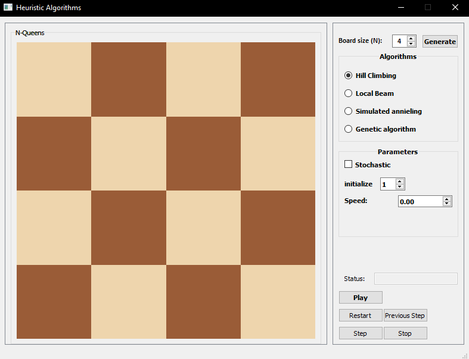
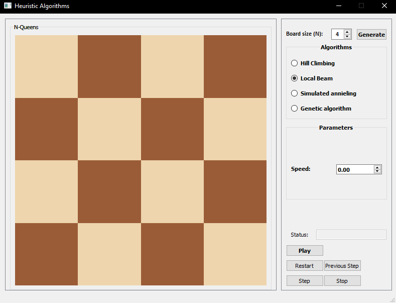
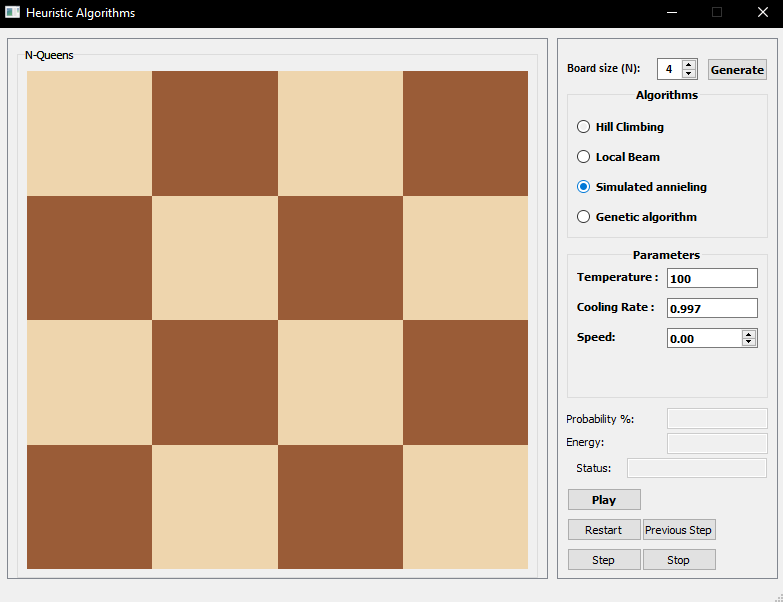
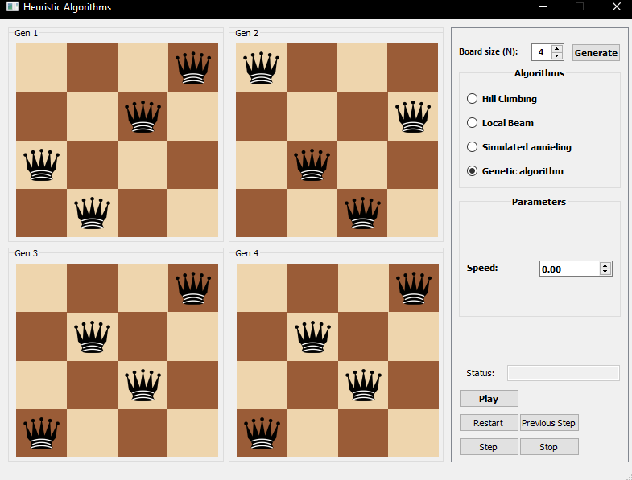

# N-Queen solver
 ( Using: Hill Climbing, Local Beam Simulated Annieling and Genetic Algorithm)  to solve the N-queen problem
Start the program by choosing desired algorithm and then generate the board and (step) once then you can click play to use it normally 

